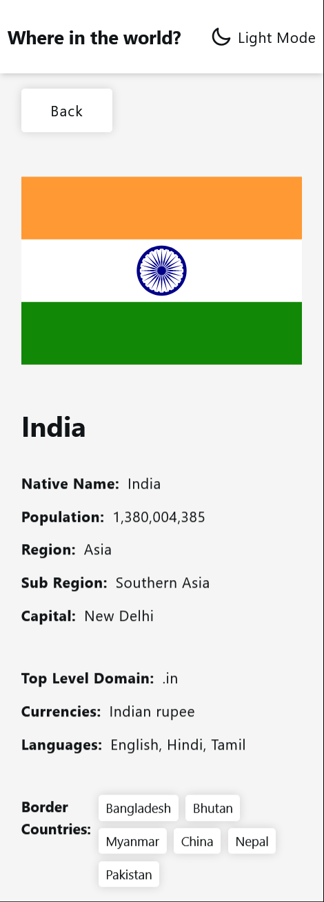

# Frontend Mentor - REST Countries API with color theme switcher solution

This is a solution to the [REST Countries API with color theme switcher challenge on Frontend Mentor](https://www.frontendmentor.io/challenges/rest-countries-api-with-color-theme-switcher-5cacc469fec04111f7b848ca). Frontend Mentor challenges help you improve your coding skills by building realistic projects.

## Table of contents

- [Overview](#overview)
  - [The challenge](#the-challenge)
  - [Screenshot](#screenshot)
  - [Links](#links)
- [My process](#my-process)
  - [Built with](#built-with)
  - [Useful resources](#useful-resources)
- [Author](#author)
- [Acknowledgments](#acknowledgments)

## Overview

### The challenge

Users should be able to:

- See all countries from the API on the homepage
- Search for a country using an `input` field
- Filter countries by region
- Click on a country to see more detailed information on a separate page
- Click through to the border countries on the detail page
- Toggle the color scheme between light and dark mode

### Screenshot

- Desktop
  
  
  
  

- Mobile
  
  
  
  

### Links

- Solution URL: [https://github.com/mbramani/rest-countries-api-with-color-theme-switcher](https://github.com/mbramani/rest-countries-api-with-color-theme-switcher)
- Live Site URL: [https://mbramani.github.io/rest-countries-api-with-color-theme-switcher/](https://mbramani.github.io/rest-countries-api-with-color-theme-switcher/)

## My process

### Built with

-   Semantic HTML5 markup
-   CSS
-   JavaScript
-   [React](https://reactjs.org)
-   [TailwindCss](https://tailwindcss.com/)
-   [Styled Components](https://styled-components.com/)
-   [Twin.macro](https://github.com/ben-rogerson/twin.macro)
-   Mobile-first workflow

### Useful resources

[TailwindCss](https://tailwindcss.com/)

## Author

-   Frontend Mentor - [@mbramani](https://www.frontendmentor.io/profile/mbramani)
-   Github - [@mbramani](https://github.com/mbramani)
